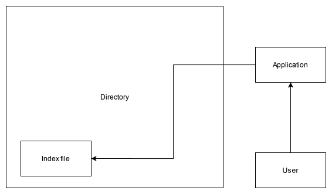

# DSA Project - Phase 1

## Project choosen

Terminal-Based Search Engine for Large Documents

## Reason for choosing this project

- Building this project would help me understand real life usage of multiple complex data structure.
- Would get a chance to work on string based algorithms.
- Able to get an idea of how a search engine works

## Research and creation of a detailed outline document on how you plan to build this projec

After researching on this topic I have found that the base data structure for a search engine is **Inverted Index**. So the application must be able to index the keywords and map the keywords to the documents present.
The initial steps that I have identified to build a document search engine are

- Build a terminal based GUI using python or Java.
- A base directory must be choosen by the user to index.
- Once the base directory is choosen, the application will index the documents available.
- On startup, the app will scan the available files and compare it with the logs it had created during the last scan.
- If any new files are added, it will be indexed and if any files are removed, then those files will be removed from the index.
- The terminal can be used by the user to query documents using keyword.

## High Level Design

